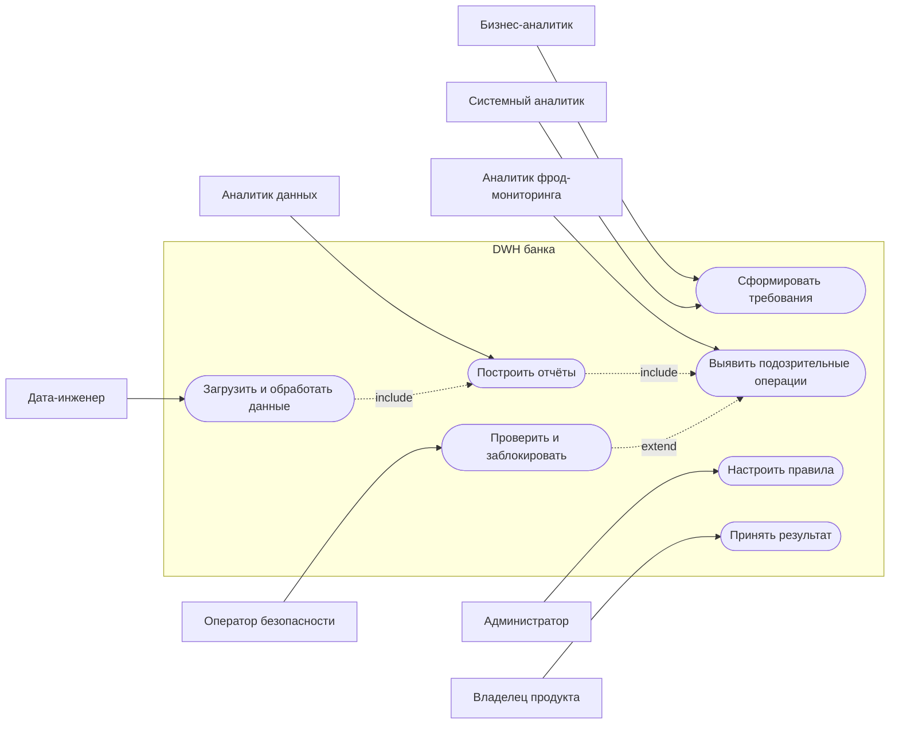

# Требования к DWH банка

## Источники данных

Банк получает данные из нескольких систем, каждая из которых отвечает за свою часть информации:

- **Транзакционная база процессинга** — основной источник, откуда приходят все операции по картам: покупки в магазинах, переводы между счетами, снятие наличных, оплата услуг, с указанием суммы, даты, времени, валюты и получателя платежа;
- **CRM-система** — хранит профиль клиента: ФИО, дату рождения, тип клиента (физлицо или юрлицо), контактные данные, дату открытия первого счёта и сегмент (массовый, премиальный, VIP);
- **Карточная система** — связывает конкретную карту с клиентом и содержит тип карты (дебетовая, кредитная, виртуальная), платёжную систему (Visa, Mastercard, МИР), срок действия и статус (активна, заблокирована, просрочена);
- **Система фрод-мониторинга** — записывает логи подозрительных действий: попытки входа с нового устройства, операции из необычных регионов, множественные отказы по PIN-коду.

## Архитектура DWH

Хранилище данных построено по классической многослойной архитектуре, где каждый слой выполняет свою задачу:

- **Сырой слой (Staging)** — сюда каждый день по расписанию загружаются данные из всех источников в том виде, в каком они есть, без каких-либо изменений, чтобы всегда можно было вернуться к оригиналу и перепроверить;
- **Слой очистки (Cleansing)** — здесь данные приводятся в порядок: удаляются дубли, исправляются ошибки в форматах дат и сумм, пустые значения заполняются или помечаются, а все данные приводятся к единому стандарту (например, суммы — в рублях, даты — в формате ГГГГ-ММ-ДД);
- **Слой моделирования (Core/DDS)** — на этом уровне строится связная модель данных по схеме «звезда» или «снежинка», где таблицы фактов (транзакции, подозрительные операции) соединяются с таблицами измерений (клиенты, карты, даты, категории операций);
- **Слой витрин (Data Mart)** — готовые таблицы с уже посчитанными показателями, которые аналитики и дашборды используют напрямую, например витрина среднего чека по клиентам или витрина подозрительных операций за сутки.

## Роли в команде

В работе над хранилищем участвует несколько специалистов, каждый из которых отвечает за свой этап:

- **Бизнес-аналитик** — общается с заказчиками из бизнес-подразделений (розничный блок, маркетинг, служба безопасности), выясняет что именно нужно посчитать, какие метрики важны и в каком виде нужен результат;
- **Системный аналитик** — переводит бизнес-требования в техническую документацию: проектирует структуру таблиц, описывает поля и их типы, рисует схемы связей и пишет техническое задание для разработчиков;
- **Дата-инженер** — разрабатывает ETL-процессы, которые забирают данные из источников, прогоняют через слои очистки и моделирования и собирают итоговые витрины, а также следит за тем, чтобы загрузки работали стабильно и по расписанию;
- **Аналитик данных** — проверяет корректность расчётов в витринах, сравнивает цифры с первоисточниками, строит отчёты и графики для бизнеса и помогает интерпретировать результаты;
- **Аналитик фрод-мониторинга** — каждый день просматривает список подозрительных операций, оценивает степень риска и принимает решение о дальнейших действиях;
- **Оператор безопасности** — связывается с клиентами по телефону или в чате для подтверждения подозрительных транзакций и при необходимости инициирует блокировку карты;
- **Администратор системы** — настраивает пороговые значения и правила детекции (например, порог перцентиля или количество переводов), управляет расписанием расчётов и правами доступа;
- **Владелец продукта** — расставляет приоритеты задач, решает что делать в первую очередь и принимает итоговый результат от команды.

## Пример: Детектор подозрительных операций

Система каждый день в 06:00 автоматически проверяет все транзакции за сутки и помечает как подозрительные те, что превышают 95-й перцентиль клиента по сумме за 90 дней, те, где одному получателю ушло больше 3 переводов за 24 часа, и те, что прошли ночью с 00:00 до 05:00 — после чего аналитик утром открывает дашборд, видит список с причинами попадания и может отфильтровать, проверить или отправить на блокировку.

## UML Use Case диаграмма

